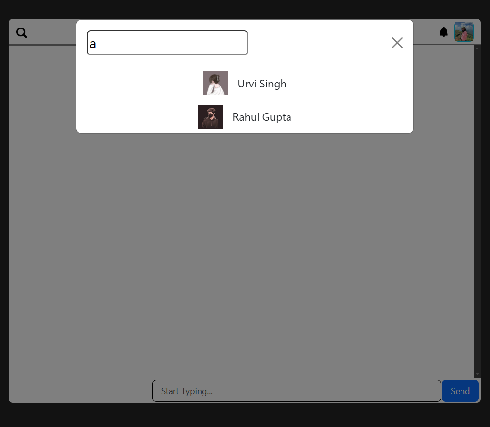
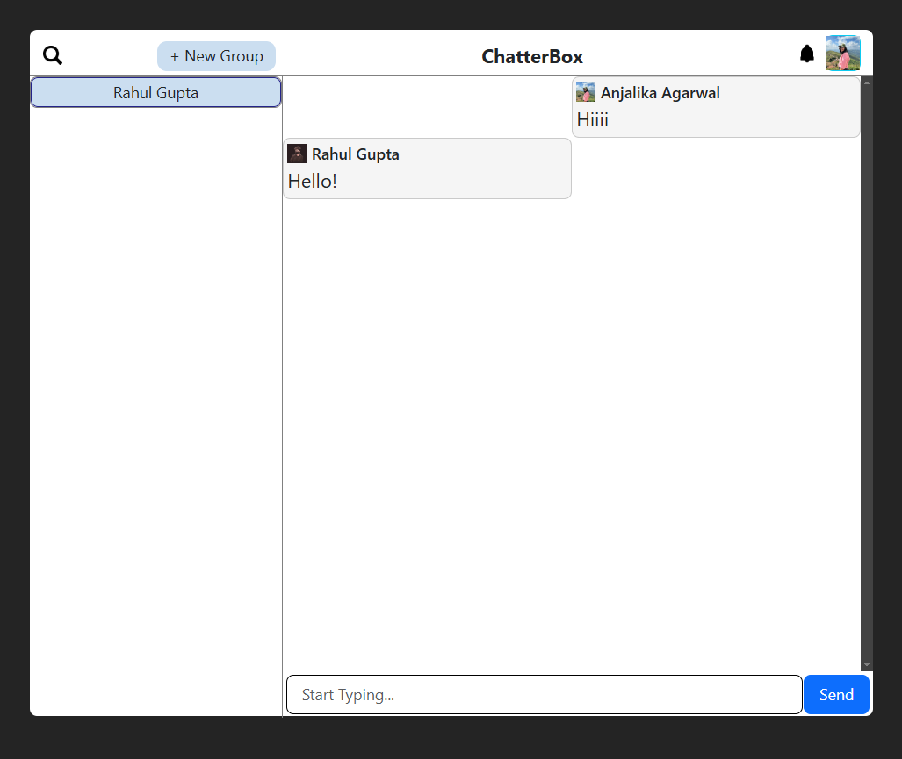
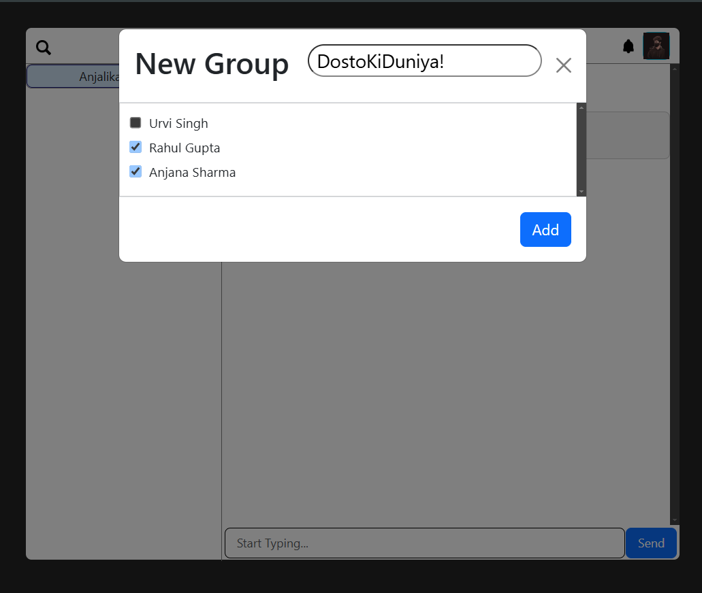
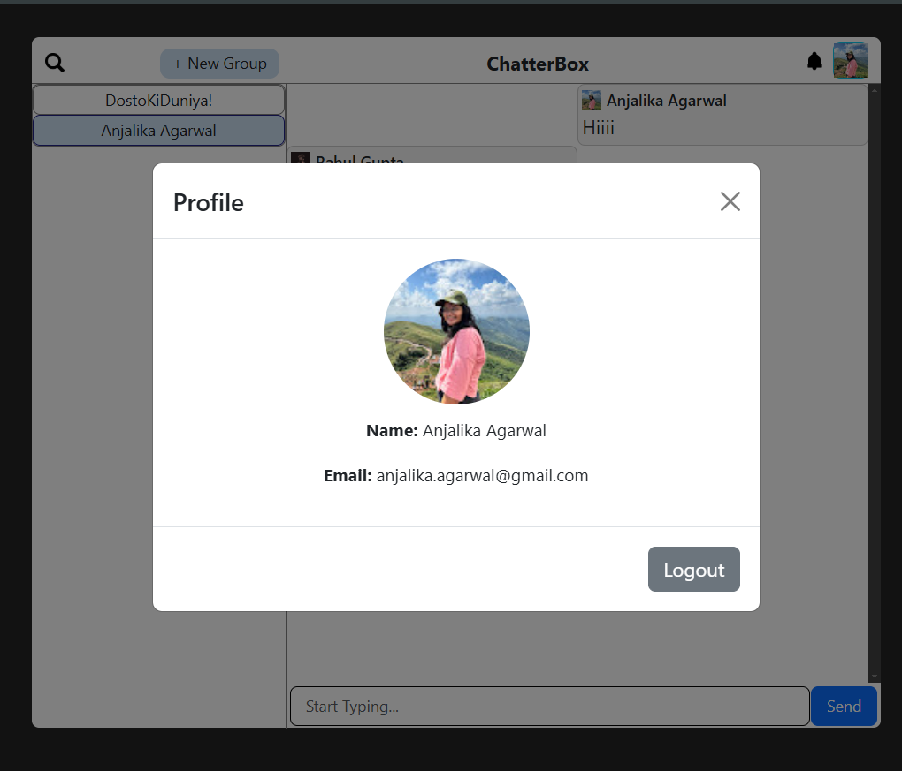

# ChatterBox
#### It is a Full Stack Chatting App. Uses Socket.io for real time communication and stores user details in encrypted format in Mongo DB Database.

### Tech-Stack:
- **Client:** React.js, Next.js
- **Server:** Nodejs, Expressjs
- **DataBase:** MongoDB
- **Real-time Communication**: WebSockets, Socket.io
- **Authentication:** OAuth

  ### Run Locally
  `git clone https://github.com/anjalika27/ChatterBox.git`
  `cd ChatterBox`
  #### Individually run the follwing commands for frontend and backend folder
  `npm install`  
  `npm run dev`

  #### Add .env file
  - PORT and DB_URL

  #### Some Screenshots:

  

  

    
    
  

  
  

  #### Made By:
  [Anjalika](https://github.com/anjalika27)

